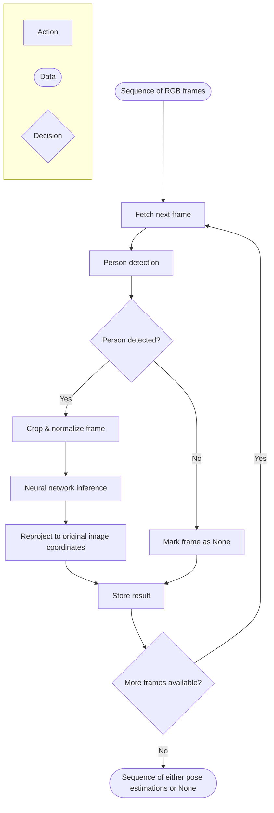

# I. Enhanced SAM 3D Body Inference: Conceptual Overview

> *This document describes the high-level conceptual architecture of the Enhanced SAM 3D Body Inference package.*

## Task

When I started this project, I was given a concrete objective: build a production-grade inference pipeline for 3D human pose estimation from monocular video. Before selecting a neural architecture, defining the preprocessing strategy, or committing to any inference routing logic, I first needed to formalize exactly what the system must do — and, just as importantly, the properties it must satisfy. I captured this as two sets of requirements: functional requirements, describing *what* the system produces, and non-functional requirements, describing *how* it must behave.

**Functional Requirements**

| ID | Requirement |
|------|-------------|
| **FR‑1** | The system accepts a monocular video stream represented as a sequence of RGB frames. |
| **FR‑2** | For each frame, the system produces either a structured object containing 3D keypoints and their corresponding 2D projections, or `None` if no person is detected. |
| **FR‑3** | The output length must exactly match the input length, with strict index alignment: `estimation[i]` always corresponds to `frame[i]`. |
| **FR‑4** | At most one primary subject is assumed per frame. |

**Non-Functional Requirements**

| ID | Requirement |
|-------|-------------|
| **NFR‑1** | The pipeline must sustain high-throughput processing of video frame sequences, where per-frame overhead accumulates quickly across hundreds or thousands of frames. |
| **NFR‑2** | Inference must be reproducible: the same input yields the same output across runs, within the tolerance of floating-point arithmetic. |
| **NFR‑3** | The system must be distributable and usable as a black box — installable into a separate project and driven purely through its input–output contract, without copying source code across projects. |
| **NFR‑4** | Components must be modular and replaceable without rewriting the core, so that future changes (new detectors, tracking, multi-person routing) stay local to one stage. |
| **NFR‑5** | No hard constraints are placed on deployment hardware, leaving room for computationally heavier but more accurate models. |

## First Decisions

Based on the requirements above, I made the following foundational design decisions. Each one is traced back to the requirement that motivates it.

| Decision | Rationale |
|----------|-----------|
| **Machine Learning approach** | Satisfying **FR‑2** requires learning a highly non-linear mapping from RGB images to 3D joint coordinates. Classical geometric methods typically lack the representational capacity to generalize across diverse poses, viewpoints, and occlusions in real-world video. |
| **Deep Learning approach** | Deep learning provides strong representation learning for this highly non-linear pixel-to-3D-pose mapping, and generally outperforms classical ML and geometric methods in accuracy, robustness to occlusion, and generalization across viewpoints. Its higher computational and memory cost is acceptable under **NFR‑5**, which places no hard constraints on deployment hardware. |
| **Stateless per-frame processing** | The task can be formulated as: *«estimate the pose for frame t; repeat for each frame»*. Each frame is processed independently, with no explicit temporal dependency between frames, which directly supports the strict 1:1 index alignment required by **FR‑3**. Recurrent networks or other temporal sequence models are therefore not required. |
| **Modular Pipeline Decomposition** | The system is decomposed into the following stages: *localize person -> crop & normalize -> estimate 3D pose -> project coordinates back to the original image*. This separation of concerns serves both **NFR‑1** and **NFR‑4**:  - **Training efficiency**: An end-to-end model mapping raw full-frame RGB directly to 3D pose would need to implicitly learn background suppression, scale normalization, and translation invariance, making training significantly harder and less efficient.  - **Component flexibility**: The detector and pose estimator are decoupled. If future requirements introduce tracking, alternative detectors, or multi-person routing, only the preprocessing stage changes while the core model remains intact. |

## Pipeline Blueprint

With the task constraints and foundational decisions established, I needed to translate them into a concrete execution graph. I organized the flow as a strict sequential pipeline, where each frame passes through person detection, cropping and normalization, neural inference, and coordinate reprojection. Frames without valid detections bypass the model and are stored as `None`, which is what satisfies **FR‑3**: every input frame still produces an output element at the same index.

## Next Steps

The pipeline is now fully specified. I could have started building the model from scratch, but in production engineering, reinventing the wheel is rarely justified when high-quality, state-of-the-art components already exist. Building a competitive 3D pose estimator from zero would require months of architecture search, dataset curation, and representation learning — effort better spent on pipeline reliability, latency optimization, and maintainability. Instead, I chose to build on an existing pre-trained foundation and adapt it to the project's requirements. This shifts the effort from model development toward building a reliable, reproducible inference pipeline around a proven model.