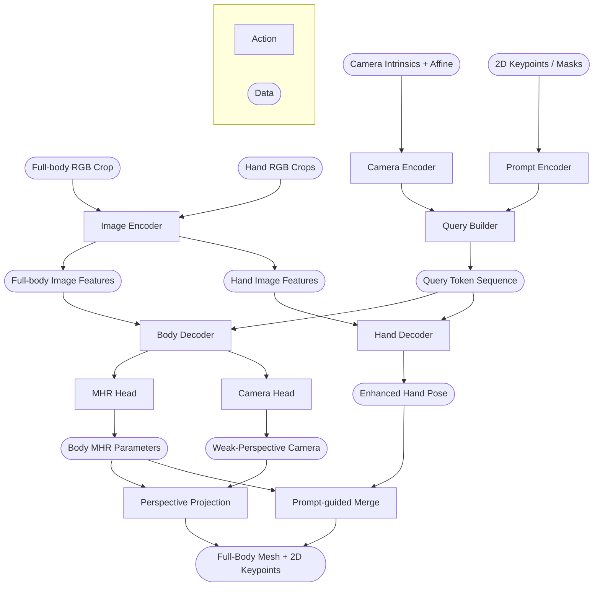

# II. **SAM 3D Body: Conceptual Overview**

> *This document describes the high-level conceptual architecture of the original SAM 3D Body.*

## Architecture at a Glance

Before adopting SAM 3D Body as the foundation of the system, I first needed to understand how its internal architecture works: what if the original architecture already satisfied the task constraints out of the box? In that case, no modifications would be necessary.

To make the analysis systematic, I represented the original architecture as a directed execution graph. To keep the diagram readable and avoid cluttering it with verbose descriptions, I moved the detailed module specifications — responsibilities, implementation approaches, and key properties — into the accompanying table. Both artifacts are presented below.

**SAM 3D Body Architecture Diagram**

**SAM 3D Body Component Logic Breakdown**

| Module | Responsibility | Implementation | Key Properties |
| -------|----------------|----------------|----------------|
| **Image Encoder** | Extract dense visual features from full-body and hand crops | Shared Vision Transformer backbone producing patch-aligned embeddings | Shared weights across both input branches; outputs used by both decoders via cross-attention |
| **Camera Encoder** | Inject geometric camera context into visual features | Fourier encoding of intrinsics + 1x1 convolution fusion | Non-learnable positional encoding; enables explicit perspective reasoning |
| **Prompt Encoder** | Encode optional user guidance into model-compatible embeddings | Keypoints -> positional tokens; masks -> convolutional feature injection | Enables interactive / guided inference |
| **Query Builder** | Assemble decoder input token sequence | Concatenation of learnable tokens, prompt embeddings, and auxiliary tokens | Fully flexible token composition; controls modality participation |
| **Body Decoder** | Predict full-body 3D human representation | Multi-layer cross-attention transformer (6+ layers) | Iterative refinement; supports auxiliary keypoint supervision |
| **Hand Decoder** | Predict high-resolution hand articulation | Separate cross-attention transformer on hand crops | Independent training stream; avoids body-hand gradient interference |
| **MHR Head** | Regress human rig parameters | Linear regression head from primary token | Outputs structured rig (pose, shape, scale) |
| **Camera Head** | Estimate weak-perspective camera parameters | Linear projection head from pose token | Produces 2D projection parameters for rendering |
| **Perspective Projection** | Map 3D outputs to 2D image space | Deterministic geometric projection | Non-learnable; preserves differentiability for training |
| **Prompt-guided Merge** | Fuse hand and body predictions | Feedback loop from hand outputs into body decoder prompts | Improves wrist alignment; removes kinematic discontinuities |

> **Note**: The original architecture described in this section is based on [SAM 3D Body: Robust Full-Body Human Mesh Recovery (arXiv:2602.15989)](https://arxiv.org/abs/2602.15989) by Xitong Yang, Devansh Kukreja, Don Pinkus, Anushka Sagar, Taosha Fan, Jinhyung Park, Soyong Shin, Jinkun Cao, Jiawei Liu, Nicolas Ugrinovic, Matt Feiszli, Jitendra Malik, Piotr Dollár, and Kris Kitani. For a deeper technical explanation, I recommend referring to the original publication.

## The Complex Pipeline in Plain Terms

The architecture is undeniably complex, which is expected for a state-of-the-art research system focused on full-body mesh recovery. But if I strip away the implementation details and describe its core intuition in plain terms, the model follows a three-stage pattern:

| Stage | Description |
|-------|-------------|
| **Feature Extraction** | Extract visual features from full-body and hand crops using a shared Vision Transformer. |
| **Conditioning & Token Building** | Condition those features on camera geometry and optional prompts via a flexible token-building mechanism. |
| **Iterative Refinement & Fusion** | Iteratively refine a 3D body representation through parallel transformer decoders, merging hand and body outputs for kinematic consistency. |

Everything beyond this core loop primarily exists to improve accuracy, robustness, or training flexibility.

## Next Steps

At a conceptual level, SAM 3D Body could be reused almost directly. The architecture already supports optional execution paths, and the dedicated hand decoder can be skipped when detailed finger articulation is not required, since the body branch already predicts hand keypoints as part of the full-body output. However, when moving from the paper's architectural diagram to the actual research codebase, practical constraints emerge.