# V. System Architecture

> *This document defines the concrete runtime architecture of the Enhanced SAM 3D Body Inference pipeline. After a brief overview, it walks through each runtime module top-down — from the `Pipeline` orchestrator down to the individual decoder heads — describing each one's responsibility, its execution flow as a diagram, and its typed input/output contract.*

## Overview

The previous sections established the conceptual architecture, identified the constraints of the reference implementation, and defined the engineering changes required for production inference. This section formalizes those design decisions as the concrete runtime architecture of the Enhanced SAM 3D Body Inference pipeline.

The document specifies:
- component responsibilities,
- execution-stage orchestration,
- typed inter-stage data contracts. [^1]

[^1]: Only the core data contracts are documented in this section. For the complete set of internal types and structures, refer to the source code, where each type is fully annotated and documented through inline comments.

## `Pipeline` Decomposition

As introduced in the conceptual overview, the inference workflow decomposes into four sequential stages:

> *localize person -> crop & normalize -> estimate 3D pose -> project coordinates back to the original image*

To reduce cognitive overhead and preserve clear separation of concerns, these stages are grouped into two high-level runtime modules:

- **`Preprocessor`** — responsible for person localization and canonical crop generation.
- **`Engine`** — responsible for pose estimation and coordinate reprojection.

This modular split follows the stage-based organization principles described in the engineering decisions section. Instead of consolidating all execution logic into a monolithic inference graph, each module encapsulates a logically isolated phase of the pipeline.

## `Pipeline` Architecture

The `Pipeline` serves as the top-level orchestration layer of the `ensam3d_inference`. It coordinates execution across preprocessing and inference modules, processes temporally ordered video frames, and maintains strict alignment between input frames and output predictions.

**Architecture Diagram**

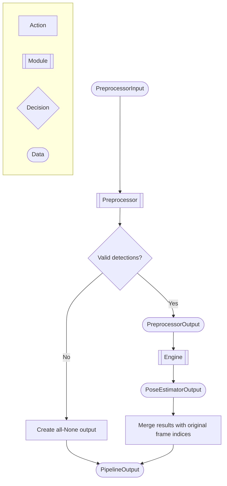

**Input / Output Contract**

| Component | Name | Description |
|-----------|------|-------------|
| **Input** | `PreprocessorInput` | Tuple containing a sequence of RGB video frames with fixed temporal ordering and an optional camera intrinsic matrix shared across all frames in the sequence. |
| **Output** | `PipelineOutput` | Sequence of per-frame results aligned 1:1 with input frames. Each element is either `None` or a structured record containing: bounding box coordinates of the selected person, detection confidence score, and full 3D pose estimation output computed from the cropped region, including predicted 3D keypoints in camera space, projected 2D keypoints in image space, vertex mesh reconstruction, weak-perspective camera parameters, camera translation, focal length, global body orientation, body pose parameters, shape coefficients, scale coefficients, hand pose coefficients, and mesh face topology. |

## `Preprocessor` Architecture

The `Preprocessor` serves as the first execution stage of the `Pipeline`. It is responsible for converting raw RGB video frames into a structured representation suitable for downstream 3D pose estimation. This includes person detection, canonical crop generation, and construction of geometric metadata required for camera-aware inference.

**Architecture Diagram**

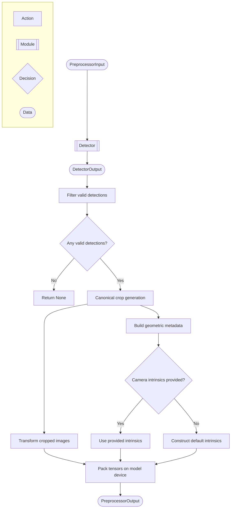

**Input / Output Contract**

| Component | Name | Description |
|-----------|------|-------------|
| **Input** | `PreprocessorInput` | Tuple containing a batch of RGB video frames with fixed temporal ordering and an optional shared camera intrinsic matrix. |
| **Output** | `PreprocessorOutput` | Structured preprocessing output containing filtered detections aligned to the input sequence, indices of frames with valid detections, cropped and normalized RGB tensors ready for model inference, geometric metadata including bounding box centers, scales, affine transforms, original and crop image sizes, and per-frame camera intrinsic matrices used for downstream 3D reconstruction. |

## `Detector` Architecture

The `Detector` serves as the initial perception stage of the `Pipeline`. It performs batched person detection on RGB frames, selects the highest-confidence bounding box per frame, and produces frame-aligned outputs with explicit handling of missing detections.

**Architecture Diagram**

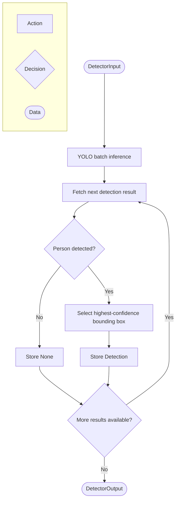

**Input / Output Contract**

| Component | Name | Description |
|-----------|------|-------------|
| **Input**  | `DetectorInput` | Batch of RGB video frames with fixed temporal ordering. All frames share identical spatial dimensions and originate from the same camera. |
| **Output** | `DetectorOutput` | Sequence of frame-aligned detection results. Each element is either `None` (no person detected) or a `Detection` record containing the selected bounding box coordinates `(x1, y1, x2, y2)` and the associated confidence score in the range `[0, 1]`. |

## `Engine` Decomposition

In the original SAM 3D Body architecture (described in the conceptual overview), the pose estimation stage combines visual feature extraction, transformer-based decoding, and geometric reconstruction into a single unified inference graph.

This project's implementation reorganizes that flow into two explicit, high-level stages:

- **Feature Extraction** — a single-pass visual encoding stage that computes dense backbone feature representations exactly once per batch.
- **Pose Estimation** — an iterative transformer-based decoding stage that operates on fixed feature embeddings to progressively reconstruct the final 3D body representation.

This separation isolates the computationally expensive image encoding stage from the iterative pose refinement logic, making the inference flow more explicit, easier to trace, and easier to maintain or extend.

## `Engine` Architecture

The `Engine` serves as the core execution stage of the `Pipeline`. It consumes preprocessed canonical image crops together with geometric metadata, performs backbone feature extraction, executes transformer-based pose decoding, and reconstructs the final 3D body representation in camera and image space.

**Architecture Diagram**

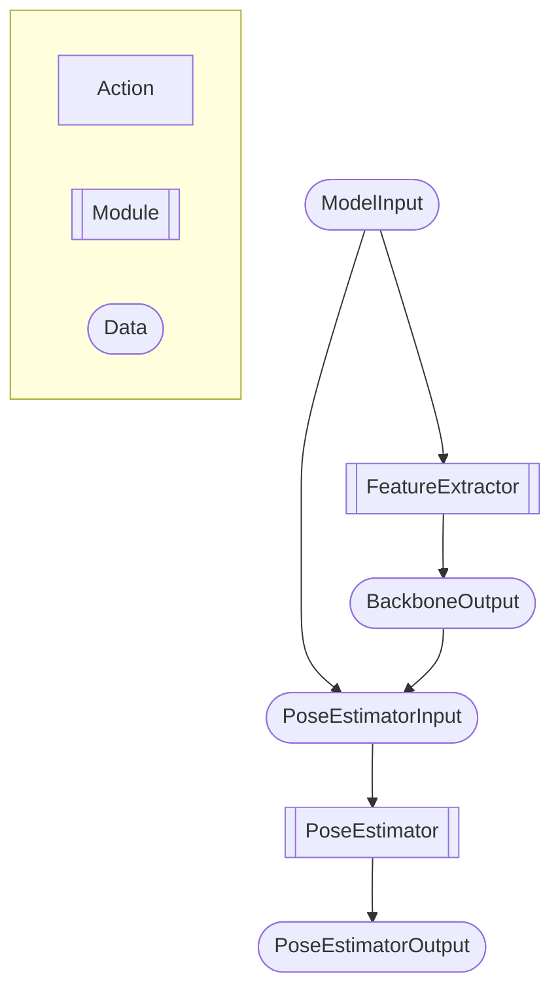

**Input / Output Contract**

| Component | Name | Description |
|-----------|------|-------------|
| **Input** | `ModelInput` | Structured batch of canonical RGB crops and geometric metadata required for camera-aware pose reconstruction, including bounding box geometry, affine transforms, original and crop image resolutions, and camera intrinsic matrices. |
| **Output** | `PoseEstimatorOutput` | Structured 3D reconstruction output containing predicted body keypoints in camera space, projected 2D keypoints in image space, reconstructed mesh vertices, weak-perspective camera parameters, camera translation vectors, focal lengths, global body orientation, body pose parameters, shape coefficients, scale coefficients, hand pose coefficients, and mesh topology information. |

## `FeatureExtractor` Architecture

The `FeatureExtractor` serves as the visual encoding stage of the `Engine`. It converts canonical RGB crops into dense spatial feature representations and augments them with explicit camera-aware geometric context derived from affine transforms and intrinsic matrices. The resulting feature maps are consumed by the downstream transformer decoder during pose reconstruction.

**Architecture Diagram**

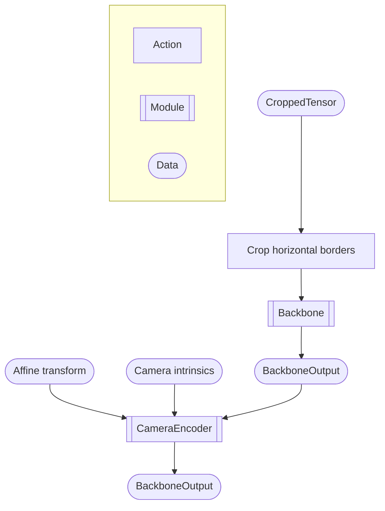

**Input / Output Contract**

| Component | Name | Description |
|-----------|------|-------------|
| **Input** | `CroppedTensor` | Batch of canonical person-centered RGB crops represented as normalized tensors with fixed spatial resolution shared across all frames in the batch. |
| **Input** | `AffineTransTensor` | Batch of affine transformation matrices mapping coordinates from original image space into canonical crop space. |
| **Input** | `CamIntrinsicsTensor` | Batch of camera intrinsic matrices containing focal lengths and principal point parameters used for camera-aware feature encoding. |
| **Output** | `BackboneOutput` | Dense spatial feature representations produced by the visual backbone and augmented with camera-aware geometric embeddings for downstream transformer decoding. |

## `Backbone` Architecture

The `Backbone` serves as the primary visual representation module of the `FeatureExtractor`. It transforms normalized RGB image crops into dense spatial embeddings using a Vision Transformer architecture composed of patch projection, positional encoding, stacked transformer blocks, and feature-grid reconstruction.

**Architecture Diagram**

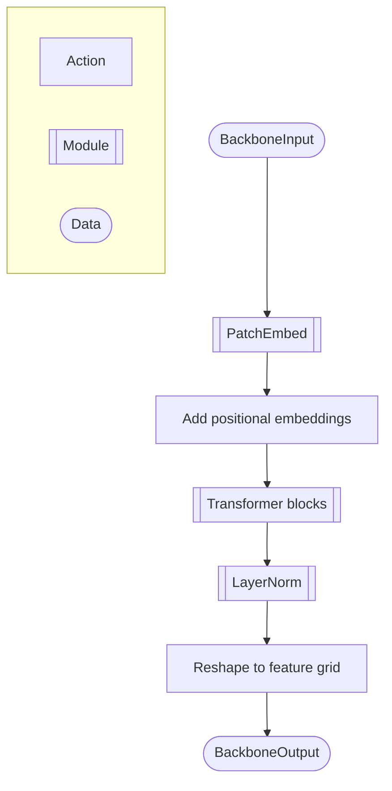

**Input / Output Contract**

| Component | Name | Description |
|-----------|------|-------------|
| **Input** | `BackboneInput` | Batch of normalized RGB image tensors produced from canonical person crops after affine warping and ImageNet normalization. |
| **Output** | `BackboneOutput` | Dense channel-major spatial feature maps produced by the Vision Transformer backbone and reshaped into patch-aligned feature grids for downstream decoding stages. |

## `CameraEncoder` Architecture

The `CameraEncoder` serves as the geometric conditioning stage of the `FeatureExtractor`. It augments backbone feature maps with explicit camera-aware spatial context derived from affine transformations, intrinsic matrices, and image resolution metadata. This enables downstream transformer layers to reason about perspective and scale directly in feature space rather than learning these relationships implicitly.

**Architecture Diagram**

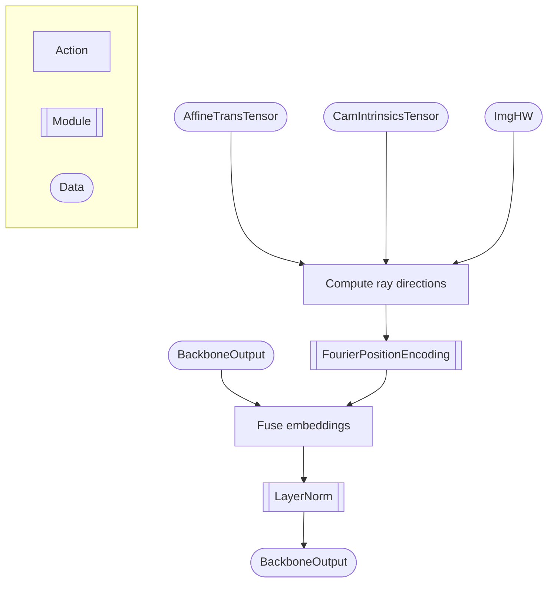

**Input / Output Contract**

| Component | Name | Description |
|-----------|------|-------------|
| **Input** | `BackboneOutput` | Dense spatial feature maps produced by the visual backbone before geometric conditioning. |
| **Input** | `AffineTransTensor` | Batch of affine transformation matrices mapping original image coordinates into canonical crop space. |
| **Input** | `CamIntrinsicsTensor` | Batch of camera intrinsic matrices used to reconstruct camera-aware ray directions. |
| **Input** | `ImgHW` | Spatial image dimensions `(H, W)` used to construct the pixel coordinate grid for ray direction computation. |
| **Output** | `BackboneOutput` | Geometrically conditioned feature maps augmented with Fourier-encoded camera-aware spatial embeddings for downstream transformer decoding. |

## `PoseEstimator` Architecture

The `PoseEstimator` serves as the iterative reconstruction stage of the `Engine`. It consumes camera-aware backbone feature maps together with geometric metadata, performs transformer-based cross-attention decoding, progressively refines pose representations across multiple decoder layers, and reconstructs the final 3D body representation through geometric projection and regression heads.

**Architecture Diagram**

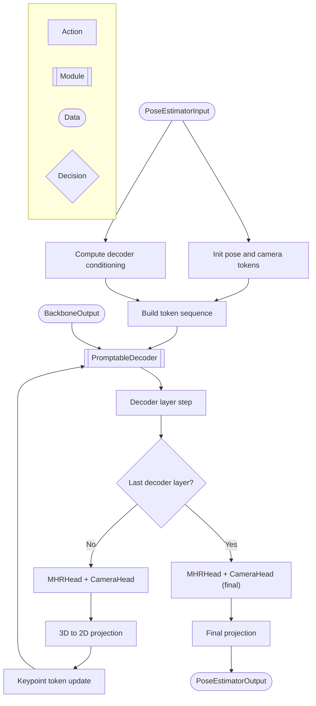

**Input / Output Contract**

| Component | Name | Description |
|-----------|------|-------------|
| **Input** | `PoseEstimatorInput` | Structured batch containing camera-aware backbone feature maps together with geometric metadata required for transformer-based pose reconstruction, including bounding box geometry, affine transforms, crop and original image resolutions, and camera intrinsic matrices. |
| **Output** | `PoseEstimatorOutput` | Structured 3D reconstruction output containing predicted body keypoints in camera space, projected 2D keypoints in image space, reconstructed mesh vertices, weak-perspective camera parameters, camera translation vectors, focal lengths, global body orientation, body pose parameters, shape coefficients, scale coefficients, hand pose coefficients, and mesh topology information. |

## `PromptableDecoder` Architecture

The `PromptableDecoder` serves as the iterative transformer decoding core of the `PoseEstimator`. It consumes pose token sequences together with image feature embeddings, performs repeated cross-attention refinement across stacked decoder layers, and progressively updates pose representations through intermediate geometric feedback and token refresh operations.

**Architecture Diagram**

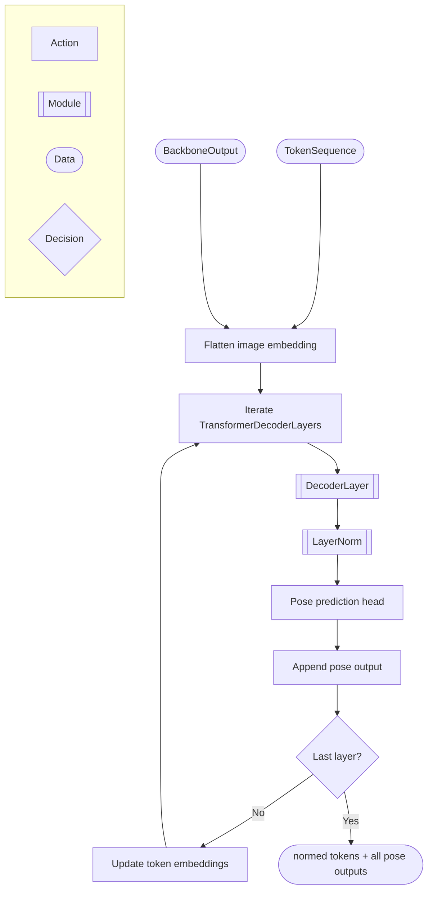

**Input / Output Contract**

| Component | Name | Description |
|-----------|------|-------------|
| **Input** | `TokenSequence` | Batched transformer token embeddings representing the current pose state and auxiliary decoder tokens used during iterative refinement. |
| **Input** | `BackboneOutput` | Dense spatial image feature maps produced by the `FeatureExtractor` and consumed as cross-attention context by decoder layers. |
| **Input** | `ContextSequence` | Flattened image-context embeddings and positional augmentations used as keys and values during cross-attention operations. |
| **Output** | `TokenSequence` | Final normalized token embeddings after the last decoder refinement stage. |
| **Output** | `list` | Sequence of intermediate and final pose predictions collected after each decoder layer during iterative reconstruction. |

## `MHRHead` Architecture

The `MHRHead` serves as the geometric reconstruction stage of the `PoseEstimator`. It converts decoder pose tokens into structured body parameters, reconstructs the articulated human mesh through the MHR solver, and produces 3D skeletal and mesh representations used for downstream projection and visualization.

**Architecture Diagram**

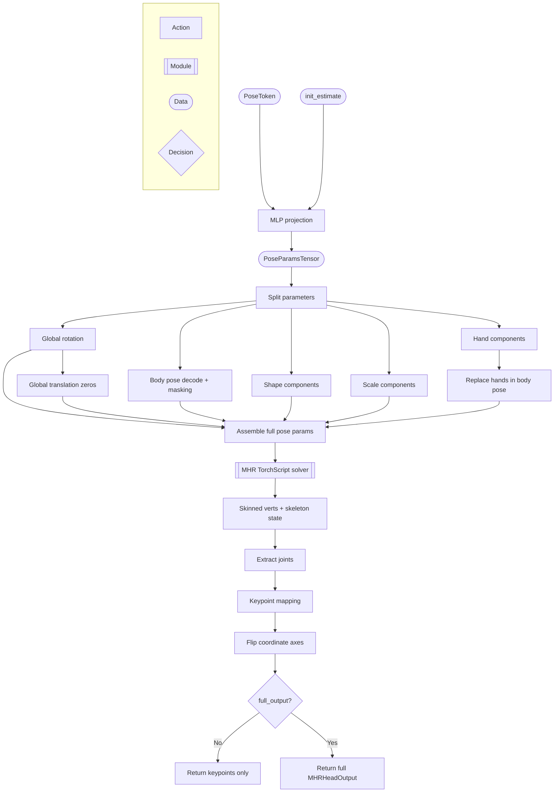

**Input / Output Contract**

| Component | Name | Description |
|-----------|------|-------------|
| **Input** | `PoseToken` | Decoder pose token representing the current latent body state extracted from the transformer decoder output sequence. |
| **Input** | `PoseParamsTensor` | Initial additive pose parameter estimate used as residual conditioning during parameter regression. |
| **Output** | `MHRHeadOutput` | Structured geometric reconstruction output containing predicted 3D body keypoints, reconstructed mesh vertices, global body orientation, body pose parameters, shape coefficients, scale coefficients, hand pose coefficients, and raw pose parameter representations. |

## `PerspectiveHead` Architecture

The `PerspectiveHead` serves as the camera parameter regression stage of the `PoseEstimator`. It converts decoder pose tokens into weak-perspective camera parameters used for geometric reprojection of reconstructed 3D body representations back into image space.

**Architecture Diagram**

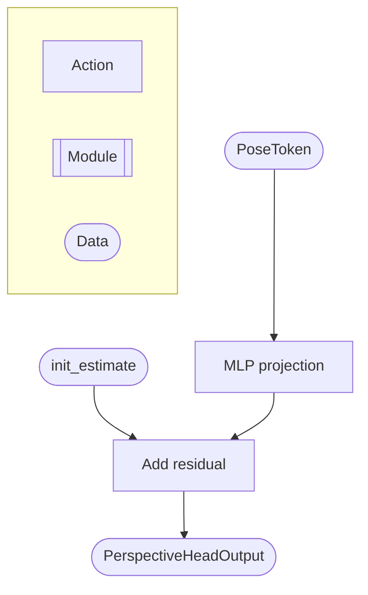

**Input / Output Contract**

| Component | Name | Description |
|-----------|------|-------------|
| **Input** | `PoseToken` | Decoder pose token representing the current latent body and camera state extracted from the transformer decoder output sequence. |
| **Input** | `PerspectiveHeadOutput` | Initial weak-perspective camera estimate used as additive residual conditioning during camera parameter regression. |
| **Output** | `PerspectiveHeadOutput` | Predicted weak-perspective camera parameters containing scale and image-plane translation values `(s, tx, ty)` used for downstream 3D-to-2D reprojection. |